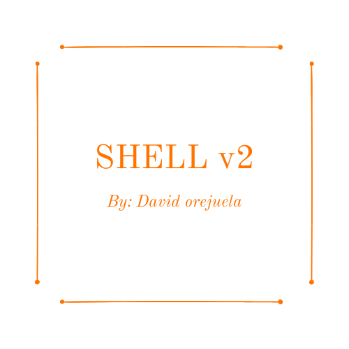

[](https://GitHub.com/Naereen/StrapDown.js/graphs/commit-activity) [](http://lbesson.bitbucket.org/) [](https://lbesson.mit-license.org/) [](https://github.com/Naereen/badges)  [](https://GitHub.com/Naereen/)
<p align="center">
  
</p>

#  Shell v2 

> **(A custom shell based on bash.)**

Shell v2 is an advance command interpreter that executes commands that are read from the standard input, handles redirections (>, >>, <, <<), pipelines (|), multi-command input (cmd ; cmd2 ; cmd3), variable replacement  ($?, $$, $VAR) and comments (#).

Shell v2 will execute directly any binary file that you want to execute in your system if it can find it directly, or is listed in the PATH environment variable. Each input receive in interactive mode will issue a prompt and increase the line counter, if a command can not be found or execute it will return the line counter, and the respective error message immediately.

### Team 🎮

 [David Orejuela](https://github.com/daorejuela1) <br>  Software Developer|
| -------------- |
 
| <a href="https://twitter.com/DavidOrejuela14" ></a> &nbsp;<a href="https://www.linkedin.com/in/davidorejuela14/" ></a> <a href="https://medium.com/@daorejuela1" ></a>|

## Motivation 🏋

Default Shells like Bash or Zsh are programs that take care of a lot of cases, customization and input parsing, re-creating from scratch one so complex is a really hard task. In order to customize even more a Shell it would be better to start from a base but my motivation is to deeply understand how a Shell works under the hood and what system calls are needed to perform every action.

## Code style 👓


Betty  ☞ [](https://github.com/holbertonschool/Betty)

## Demo📷
<center>

## Simple Commands
<p style="font-size:25px; font-weight:bold"> 

</p>

--------------

## Pipelines
<p style="font-size:25px; font-weight:bold">

</p>

---

## Comments
<p style="font-size:25px; font-weight:bold">

</p>

---

## Variable expansion
<p style="font-size:25px; font-weight:bold">

</p>

---

## Redirection
<p style="font-size:25px; font-weight:bold"> 

</p>

---

## Aliases
<p style="font-size:25px; font-weight:bold"> 

</p>
</center>

## Tech used 🛠


This C program is created under GCC version 4.8.4 (Ubuntu 4.8.4-2ubuntu1~14.04.4) with the use of the follow system calls:

-   `access`
-   `chdir`
-   `close`
-   `execve`
-   `fork`
-   `stat`  
-   `open`
-   `read`
-   `wait`
-   `write`
-   `dup`
-   `dup2`
-   `pipe`
-   `getpid`
-   `__errno_location`  (errno macros)
-   `closedir`
-   `exit`
-   `free`
-   `getcwd`
-   `getline`
-   `malloc`
-   `perror`
-   `strtok`
-   `isatty`
-   `printf`
-   `fflush`
-   `fprintf`


## Requirements 📚

- Ubuntu 14.04+
- GCC version 4.8.4

## Installation & Init 📖

Please make sure that you have installed the essentials before cloning:

```
sudo apt-get install build-essential
```

1. Clone the repository: `https://github.com/daorejuela1/shell_v2/`
2. Go to the folder: `cd shell_v2`
3. Compile the application: `make`

## Usage 💪

After successfully executing the `make` command

Execute `./hsh` to start the shell in interactive mode.

If you want to execute the shell in not interactive mode you can do it this ways:

 1. `./hsh [FILENAME]`
    
   2. `echo [COMMAND] | ./hsh`
    
   3. `cat [FILENAME] | ./hsh`
---
To read the man page use:  `man ./man_1_hsh`
## Features 📜
 
 ### Built-in commands
 
This shell contains builtins commands to perform certain action which means that instead of using binary files, the same shell is in charge of performing the actions:

|Name| Description | Example |
|--|--| --|
| alias | Define or display aliases. | alias [name=value] ... [name2=value2]|
|cd|Change the shell working directory|cd [path]|
|env|prints all the current environment variables no arguments are needed.| env|
|exit|Exits the shell with a status of N.  If N is omitted, the exit status is of the last command.| exit [n]|
|setenv|Sets a new environmental variable.|setenv [name] [value]|
|unsetenv|Unsets a environmental variable.| unsetenv [name]|
|help| Display help about the specific command| help [builtin command]|
|history|Prints the commands used in the session| history|

### Files

 - ~/.hshrc
         Startup file that's executed before starting the shell v2
   
 - ~/.hsh_history
 File that stores the executed commands

## Contributing 🧍

Contributions are always welcome!

Please read the [contribution guidelines](CONTRIBUTING.MD) first.

## Related projects 💼

Here are some awesome projects I have been working on:

|[Mastermind Hackday Project](https://github.com/daorejuela1/mastermind)| [Daily tweet](https://github.com/daorejuela1/daily_tweet) | [Monty bytecode decoder](https://github.com/daorejuela1/monty) | [Serpent Algorithm](https://github.com/daorejuela1/serpent) | [Custom Shell v1](https://github.com/daorejuela1/simple_shell)
|--|--|--|--|--|
|  |  |  |  |  |

## Licensing 🔑

[](/LICENSE)

Released in 2021 by @[daorejuela1](https://github.com/daorejuela1)

## Credits ✈

Special thanks to [Alexandre Gautier](github.com/Mattrack) for his guidance in the development of this project.
